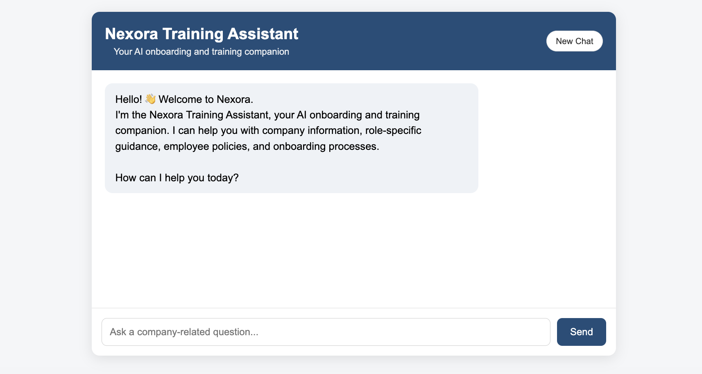
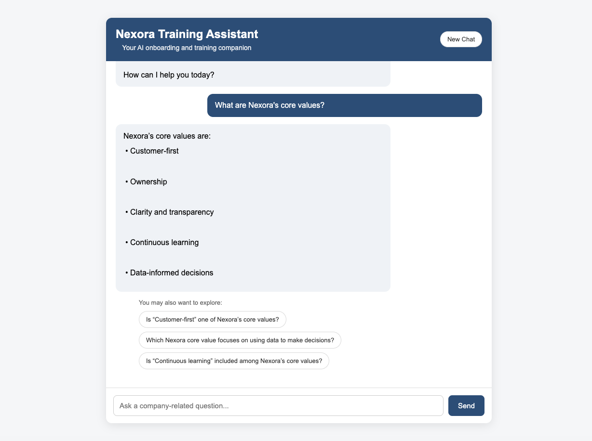
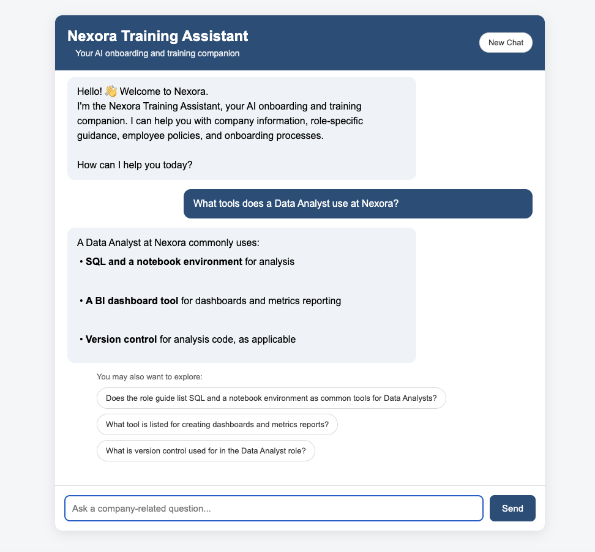
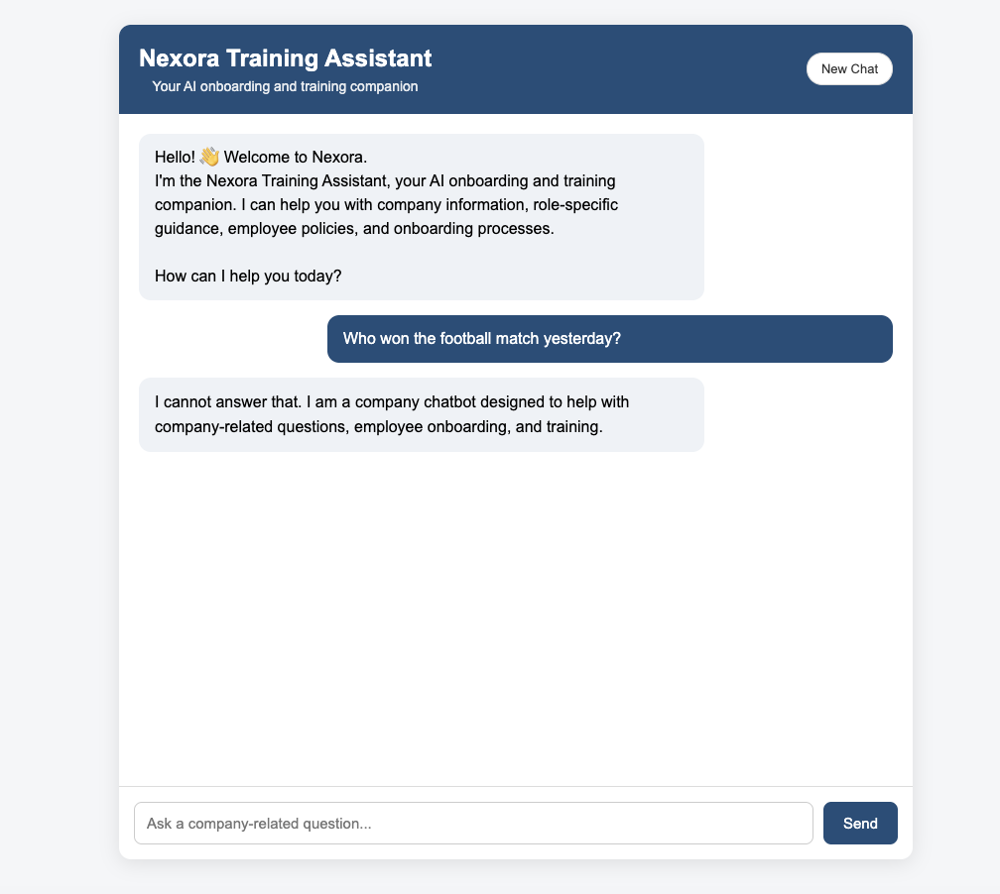

# AI Training Assistant for New Employees

An AI-powered onboarding and training assistant that answers employee questions using a company knowledge base and Retrieval-Augmented Generation (RAG).

## Company Context

The assistant is configured for **Nexora**, a fictional data and analytics services organization.

Nexora helps businesses turn complex data into clear insights and informed decisions through data analysis, reporting, and visualization.

## Objectives

- Support new employee onboarding and training.
- Classify and route questions to the appropriate knowledge source.
- Retrieve relevant company information using RAG.
- Generate grounded, concise answers.
- Prevent hallucinated company information.
- Handle sensitive and action-based requests safely.
- Use conversation context for follow-up questions.
- Generate grounded follow-up suggestions.

## Architecture

```text
Employee
   ↓
Chatbot UI
   ↓
Conversation Context
   ↓
Query Classifier / Router
   ├── GENERAL → Company RAG
   ├── ROLE → Role / Team RAG
   ├── ADMIN → Admin / Policy RAG
   └── OTHER → Scope / Guardrail Handling
   ↓
Evidence Checker
   ├── Supported → Grounded LLM Response
   └── Unsupported → Grounded Fallback
   ↓
Follow-up Suggestions
```

## Technology Stack

- Python
- FastAPI
- HTML / CSS / JavaScript
- OpenAI API
- LangChain
- ChromaDB
- OpenAI `text-embedding-3-small`
- python-dotenv

## Project Structure

```text
AI_Training_Assistant_for_New_Employees_Nexora/

├── app/
│   ├── main.py
│   ├── ingest.py
│   ├── create_vector_db.py
│   ├── search_test.py
│   ├── classifier.py
│   ├── router_test.py
│   ├── evidence_checker.py
│   ├── fallback_test.py
│   ├── personal_data_guard.py
│   ├── action_guard.py
│   ├── ambiguity_guard.py
│   ├── followup_suggestions.py
│   ├── evaluate_routing.py
│   ├── evaluate_retrieval.py
│   ├── evaluate_answers.py
│   ├── evaluate_guardrails.py
│   ├── evaluate_conversation.py
│   └── evaluate_end_to_end.py

├── frontend/
│   ├── index.html
│   ├── style.css
│   └── script.js

├── data/
│   ├── knowledge_base/
│   └── chroma_db/

├── evaluation/
│   ├── evaluation_set.csv
│   ├── routing_results.csv
│   ├── retrieval_results.csv
│   ├── answer_results.csv
│   ├── guardrail_results.csv
│   └── end_to_end_results.csv

├── screenshots/
│   ├── 01_welcome.png
│   ├── 02_core_values.png
│   ├── 03_data_analyst_tools.png
│   └── 04_out_of_scope.png

├── .env
├── requirements.txt
└── README.md
```

## Knowledge Base

The current synthetic knowledge base for Nexora covers:

- Company overview and communication norms
- Data Analyst and Product Manager roles
- HR processes
- IT access
- Onboarding
- Timesheets and attendance
- Travel
- Expenses
- Leave
- Code of conduct
- Security and compliance
- Onboarding FAQ

The current vector database contains **13 documents and 16 chunks**:

- GENERAL: 2
- ROLE: 2
- ADMIN: 12

## Setup

Install dependencies:

```bash
pip install -r requirements.txt
```

Create `.env` in the project root:

```text
OPENAI_API_KEY=your_actual_key
```

Never commit or share the API key.

## Build the Vector Database

From the project root:

```bash
python app/create_vector_db.py
```

## Run the Application

```bash
uvicorn app.main:app --reload
```

Open the local address displayed by Uvicorn in your browser.

## Evaluation

### Routing

```bash
python -m app.evaluate_routing
```

**Current result: 20/20 — 100%**

### Retrieval

```bash
python -m app.evaluate_retrieval
```

**Current result: 17/17 — 100%**

### Answers

```bash
python -m app.evaluate_answers
```

**Current result: 16/17 — 94.12%**

One answer-quality test did not pass the evaluation criteria. The retrieved knowledge was correct, but the generated answer did not fully satisfy the evaluator's expected criteria. Retrieval accuracy remained 100%.

### Guardrails

```bash
python -m app.evaluate_guardrails
```

**Current result: 20/20 — 100%**

### Conversation

```bash
python -m app.evaluate_conversation
```

**Current result: 4/4 — 100%**

### End-to-End

```bash
python -m app.evaluate_end_to_end
```

Current end-to-end routing result: **20/20 — 100%**.

Detailed results are saved to `evaluation/end_to_end_results.csv`.

## Routing Categories

| Route | Purpose |
|---|---|
| GENERAL | Company-wide information |
| ROLE | Specific role, job, or team information |
| ADMIN | Employee processes, policies, and procedures |
| OTHER | Unrelated or unsupported requests |

## Safety and Grounding

The assistant is **not a general-purpose chatbot**.

It should:

- Answer company questions using the knowledge base.
- Refuse unrelated questions politely.
- Avoid inventing missing company information.
- Refuse sensitive personal-information requests.
- Refuse requests to perform real-world actions.
- Ask for clarification when a question is genuinely ambiguous.

Example out-of-scope response:

> I cannot answer that. I am a company chatbot designed to help with company-related questions, employee onboarding, and training.

## Follow-up Suggestions

After answering, the assistant can suggest three contextual follow-up questions.

Suggestions must be:

- Relevant to the current question.
- Explicitly answerable from the available company knowledge.
- Free from unsupported assumptions.
- Non-sensitive and non-action-based.

## Project Scope

- Designed as a focused **employee onboarding and training assistant** for Nexora.
- Uses a curated company knowledge base covering **company information, roles, policies and administrative processes**.
- Implements **query classification, routing, RAG-based retrieval and grounded response generation**.
- Includes **conversation context, ambiguity handling, scope control and contextual follow-up suggestions**.
- Evaluated using a structured set of employee questions to validate routing, retrieval, response quality and guardrails.

### **Beyond Current Scope**

- Authentication, role-based access and workflow execution can be added when connecting the assistant to organizational systems.
- The current knowledge base is curated; automated enterprise knowledge synchronization is a natural next step.

### **Future Enhancements**

- **Automate Knowledge Updates** — Enable document upload, indexing and scheduled knowledge refresh.
- **Improve Retrieval** — Introduce hybrid search and reranking for larger knowledge bases.
- **Access Control** — Add authentication and role-based access based on employee permissions.
- **Analytics** — Track frequently asked questions and identify knowledge gaps.
- **Internal Deployment** — Move from the prototype environment to an organization's internal platform.

## Chatbot Screenshots

### Welcome Screen



### Company Information — Core Values



### Role-Specific Guidance — Data Analyst



### Out-of-Scope Request Handling




## Project Purpose

This project demonstrates practical use of:

- LLMs
- RAG
- Query classification
- Routing/orchestration
- Vector search
- Prompt engineering
- Grounded generation
- Guardrails
- Conversation context
- Evaluation-driven development
